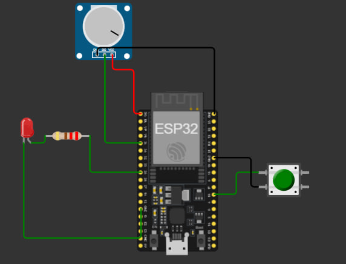

# ESP32 GPIO and Serial Communication Controller

A lightweight ESP32 firmware demonstrating digital and analog I/O handling combined with structured serial data logging. The system processes environment data via a potentiometer, monitors user input via a push-button, and controls an LED indicator's dynamic flashing rate.

## Project Overview

This project simulates a real-time hardware monitoring system. It reads an analog sensor input, maps the values to dynamically control an LED's blink frequency, and overrides the blinking behavior using a physical button. System diagnostics are continuously streamed over a serial interface.

### Live Simulation
The interactive simulation environment is available here: [Wokwi Project Link](https://wokwi.com/projects/466455279162891265)

---

## Hardware Architecture

### Component Map
| Component | ESP32 GPIO Pin | Pin Type | Mode / Configuration | Description |
| :--- | :--- | :--- | :--- | :--- |
| **Red LED** | `GPIO 25` | Digital Output | `OUTPUT` | System status indicator (Blinking/Solid) |
| **Push Button** | `GPIO 16` | Digital Input | `INPUT_PULLUP` | Overrides blink mode to force LED HIGH |
| **Potentiometer** | `GPIO 34` | Analog Input | `INPUT` (ADC1_CH6) | Simulates analog sensor reading (0-4095) |

### Circuit Diagram


---

## Serial Data Protocol

The firmware outputs structured telemetry data to the Serial Monitor at **115200 Baud** using a strict, easy-to-parse `key=value` comma-separated format.

### Field Definitions
| Field | Values | Description |
| :--- | :--- | :--- |
| `sensor` | 0 – 4095 | Raw 12-bit ADC value from the potentiometer |
| `button` | 0 / 1 | 1 = Pressed (Active LOW internal pull-up), 0 = Released |
| `led` | ON / OFF | Current state of the LED at time of transmission |

### Telemetry Sample
The following breakdown illustrates how the data stream changes state dynamically during execution:

```text
sensor=244,button=0,led=OFF
sensor=789,button=0,led=OFF
sensor=4095,button=0,led=ON   
sensor=0,button=1,led=ON    <-- Button pressed:  
sensor=0,button=1,led=ON
```
The complete continuous runtime execution log is documented in the dedicated log file: [docs/serial_log.txt](docs/serial_log.txt).

## How to Run and Test

1. Open the [Wokwi Simulation Environment](https://wokwi.com/projects/466455279162891265).
2. Click the **Start Simulation** button.
3. Open the **Serial Monitor** tab located at the bottom interface.
4. Interact with the hardware components:
   * **Adjust Speed:** Rotate the Potentiometer dial to modify the LED blink frequency. Higher analog values will cause a faster blinking rate due to dynamic scaling.
   * **Hardware Override:** Press and hold the Push Button to interrupt the blinking sequence and force the LED to remain constantly ON.

---

## Technical Implementation Details

* **Language:** C++ (Arduino Framework)
* **ADC Resolution:** 12-bit (0-4095) native resolution for ESP32.
* **Debouncing and Pull-up:** Leverages the microcontroller's internal `INPUT_PULLUP` resistor to avoid floating pin states without requiring external hardware pull-up resistors.
* **Version Control:** Developed locally utilizing Git with the Conventional Commits specification (`feat:`, `fix:`, `docs:`).